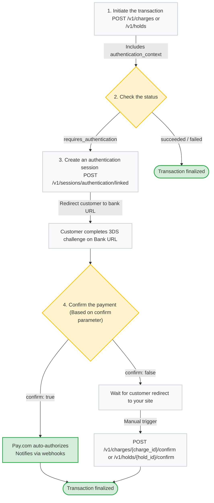

import { Callout } from 'fumadocs-ui/components/callout';

3D Secure is a standard authentication protocol used to verify a customer's identity during a transaction. Pay.com provides an **Agnostic 3DS** layer, which means the authentication is handled at the gateway level independently of the specific bank or processor. This lets you authenticate a customer once and route the authorized transaction to any processor for execution.

The system is designed to handle both frictionless flows and active challenges, where the user must verify the payment through their banking app or an SMS code.

## SDK integration

If you're using our SDKs, we handle the entire authentication flow for you. The SDK automatically detects if a card needs extra verification and manages the entire process in the background:

* The SDK automatically determines if a card requires 3DS based on your specific configuration and the bank's requirements.
* It handles the rendering of the challenge window and captures all user interaction events directly.
* It completes the authentication process and moves to the payment result without requiring you to manage manual redirections.

## API integration

If you prefer using our direct API, you'll have full control over the user experience, but you'll need to manually guide the customer through the bank's verification steps:

1. **Start the transaction:** Send a `POST` request to [`/v1/charges`](/docs/api-reference/charges/create-charge) or [`/v1/holds`](/docs/api-reference/holds/create-hold) to begin. You must include the `authentication_context` object, which includes browser details, user agents, and IP addresses. 

<Callout title="Note">
We highly recommend passing the customer's email in the `billing_details` object to maximize 3DS approval rates.
</Callout>

2. **Check the status:** If the bank requires a challenge, the API will return a transaction status of **`requires_authentication`**.
3. **Create an authentication session:** Send a `POST` request to [`/v1/sessions/authentication/linked`](/docs/api-reference/authenticationsessions/create-linked) using the ID of the transaction created in Step 1. This generates a `url` that you will use to redirect the customer to the bank’s verification page.
4. **Confirm the payment:** The `confirm` parameter dictates how Pay.com handles the final authorization:
   * If you use `confirm: true`, Pay.com will automatically authorize the payment once the challenge is completed and notify you via webhooks.
   * If you use `confirm: false`, you must wait for the customer to redirect back to your site, and then manually trigger the final authorization via a `POST` request to [`/v1/charges/{charge_id}/confirm`](/docs/api-reference/charges/confirm-charge) or [`/v1/holds/{hold_id}/confirm`](/docs/api-reference/holds/confirm-hold).

This diagram breaks down the process for API integrations. It shows how the transaction moves from your server to the bank and back again to finalize the payment:

## External 3DS

If you already perform 3DS authentication through third-party software, Pay.com supports an **External MPI (External 3DS)** flow. This lets you maintain your existing security setup while still using our orchestration engine.

To use this flow, you can pass your pre-authenticated data (such as the `DS trans id`, CAVV, or ECI) directly to the `POST /v1/charges` API via the `3DS` object. Pay.com will then pass these details to the issuer to authorize the transaction without triggering a second challenge for the customer.

## Benefits of agnostic authentication

Using a gateway-level authentication layer offers several advantages for managing global payments effectively, such as:

* You can retry a failed authorization with a different processor using the same 3DS credentials because authentication is not tied to a specific acquirer.
* The system supports the latest 3DS2 standards to favor frictionless authentication whenever the bank allows it.
* The SDK hides the complexity of device fingerprinting and challenge rendering, saving your team significant time and effort.

## Next steps

Now that you understand how Pay.com handles 3D Secure authentication, you are ready to configure your integration to handle frictionless flows and active bank challenges.

Explore the following resources to continue your integration:

* **Initiate a 3DS transaction:** If you are building an API-only integration, learn how to trigger a 3DS check by passing the `authentication_context` object to the [Create a Charge](/docs/api-reference/charges/create-charge) or [Create a Hold](/docs/api-reference/holds/create-hold) endpoints.
* **Handle active challenges:** When a transaction returns a `requires_authentication` status, use the [Create a Linked Session](/docs/api-reference/authenticationsessions/create-linked) endpoint to safely redirect the customer to their bank's verification UI.
* **Manually confirm payments:** If you opt for the synchronous `confirm: false` flow, remember to trigger the final authorization using the [Confirm a Charge](/docs/api-reference/charges/confirm-charge) or [Confirm a Hold](/docs/api-reference/holds/confirm-hold) endpoints after the customer completes the challenge.
* **Automate with webhooks:** Listen for critical asynchronous events like `charge.requires_authentication` and `charge.requires_confirmation` to automatically trigger your backend redirection and confirmation logic. Learn more in our [Webhooks and events](/docs/api-reference/webhooks/index) guide.