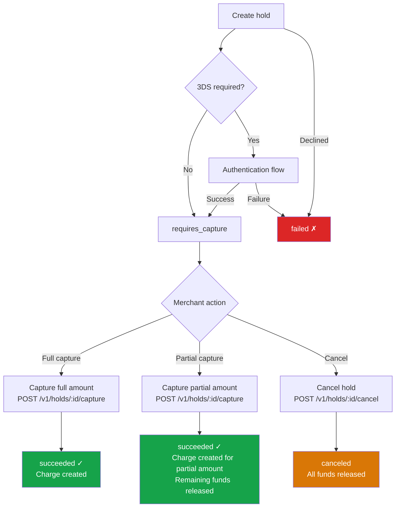

import { Callout } from 'fumadocs-ui/components/callout';

A hold (also called an authorization) reserves funds on a customer's payment method without
capturing them. This is useful when you need to confirm an order, verify inventory, or wait for
fulfillment before taking the money. Once a hold is approved, you decide when to capture the
funds or cancel the hold to release them back to the customer.

## Creating a hold

With the **SDK**, you create a payment session with `capture: false` via
`POST /v1/payment_sessions`. The SDK handles the rest, and on success Pay.com creates a hold
instead of a charge. With the **API**, you create a hold directly via `POST /v1/holds`. Just
like charges, holds accept stored payment methods, tokens, or raw card details (PCI Level 1
required for raw data).

See the [Hold and capture funds](/docs/payments/server-to-server-guides/hold-and-capture-funds)
guide for a step-by-step walkthrough of the server-to-server flow.

## The hold lifecycle

The following diagram shows how a hold moves from creation through authorization to its final
state, whether captured or canceled:

## Hold statuses

The table below describes each status a hold can reach during its lifecycle:

| Status | Meaning |
|---|---|
| `requires_capture` | The hold was approved. Funds are reserved and waiting for you to capture or cancel. |
| `succeeded` | The hold has been fully captured. One or more charges were created. |
| `canceled` | The hold was canceled. All reserved funds have been released to the customer. |
| `failed` | The hold was declined by the issuer or blocked by a payment rule. |
| `requires_authentication` | 3D Secure is needed to complete the authorization. |
| `requires_confirmation` | Authentication succeeded; awaiting merchant confirmation (when using `confirm: false`). |

## Capturing a hold

Once a hold is in `requires_capture` status, you capture it via
`POST /v1/holds/{hold_id}/capture` to move the funds. Pay.com supports three capture
strategies:

- **Full capture:** Omit the `amount` parameter (or set it to the full hold amount) to capture
  the entire authorized amount.
- **Partial capture:** Specify a smaller `amount` to capture only part of the authorized funds.
  The remaining amount is released back to the customer automatically.
- **Multiple captures:** You can capture a hold in multiple steps, as long as the total
  captured amount doesn't exceed the original authorization. Each capture creates a separate
  charge object linked to the hold.

The hold object includes an `amount_capturable` field that tells you how much is still
available to capture. This value decreases with each capture you make.

<Callout type="info">
Not all payment providers support multiple captures. Pay.com handles this transparently, if
the downstream provider doesn't support it, the API will return an appropriate error.
</Callout>

For detailed instructions, see the
[Hold and capture funds](/docs/payments/server-to-server-guides/hold-and-capture-funds) guide.

## Canceling a hold

If you no longer need to capture the funds, cancel the hold via
`POST /v1/holds/{hold_id}/cancel` to release the reservation. Cancellation releases the funds
back to the customer immediately.

<Callout type="warn">
Cancellation is **full only**, you cannot partially cancel a hold. If you need to release only
part of the funds, use a partial capture instead. The uncaptured amount will be released
automatically.
</Callout>

For detailed instructions, see the
[Cancel a hold](/docs/payments/server-to-server-guides/cancel-a-hold) guide.

## Key fields on the hold object

When you retrieve a hold via `GET /v1/holds/{hold_id}`, the response includes these important
fields:

| Field | Description |
|---|---|
| `amount` | The original authorized amount. |
| `amount_capturable` | The remaining amount available to capture. Decreases as you make captures. |
| `charges.data` | An array of charge objects created from this hold (via capture). |
| `canceled` | Whether the hold has been canceled. |
| `cancellation_reason` | The reason for cancellation, if provided. |
| `payment_session` | If this hold was created from a payment session, the session ID. |

## Webhook events

Pay.com sends webhook events as a hold progresses through its lifecycle:

| Event | Trigger |
|---|---|
| `hold.requires_capture` | The hold was approved and is waiting to be captured. |
| `hold.captured` | The hold was captured (a charge was created). |
| `hold.canceled` | The hold was canceled and funds were released. |
| `hold.failed` | The hold was declined or blocked. |
| `hold.requires_authentication` | 3D Secure is required. |
| `hold.requires_confirmation` | Authentication succeeded; awaiting merchant confirmation. |

## Common patterns

Holds are commonly used across a range of business scenarios:

- **Pre-authorization in e-commerce:** Place a hold at checkout, capture when the order ships,
  and cancel if the order is canceled before shipment.
- **Partial fulfillment:** Ship an order in multiple packages and use multiple partial captures
  so the customer is only charged for what has shipped.
- **Tip adjustment in hospitality:** Place a hold for the base amount, then capture for the
  adjusted total including the tip.
