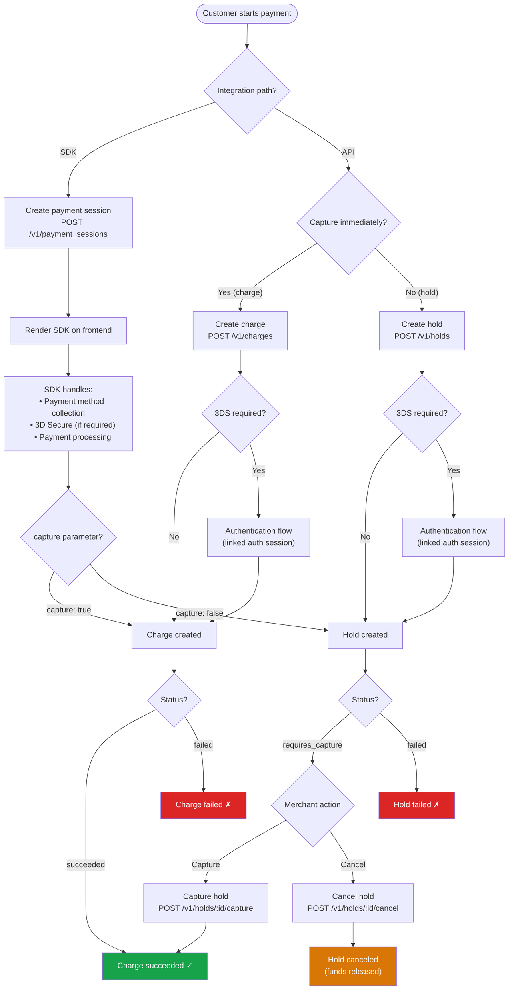
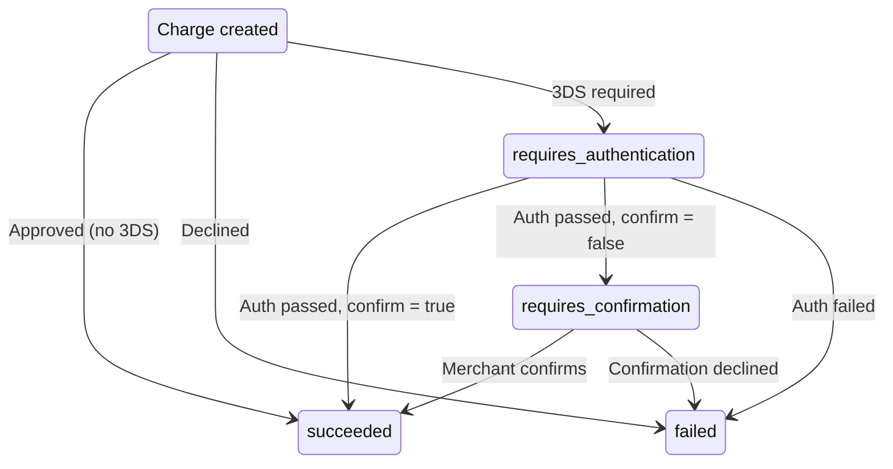
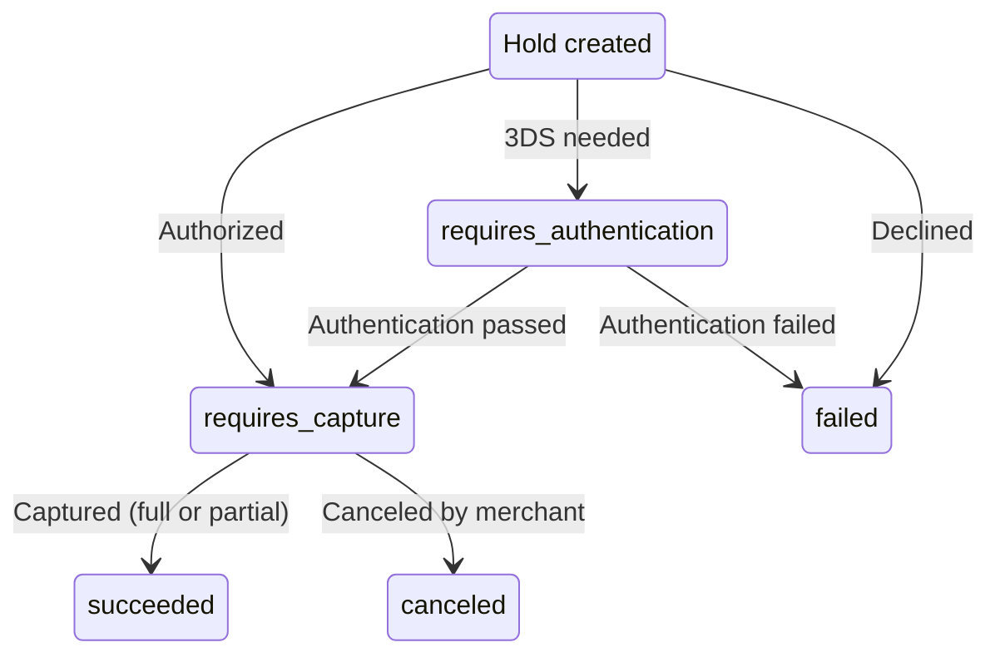

import { Callout } from 'fumadocs-ui/components/callout';

Every payment processed through Pay.com follows a lifecycle that moves through distinct stages.
This page gives you a high-level view of how those stages connect, regardless of whether you
integrate via the SDK, the API, or both.

## Core transaction types

Pay.com's payment system is built around six core transaction types:

| Transaction type | What it does | API resource |
|---|---|---|
| **Charge** | Captures a payment immediately | `chrg_*` |
| **Hold** | Authorizes funds without capturing | `hld_*` |
| **Refund** | Returns funds from a completed charge to the customer | `rfnd_*` |
| **Payout** | Sends funds from the merchant to a customer | `po_*` |
| **Payment session** | Manages a customer's checkout flow via the SDK | `ps_*` |
| **Setup session** | Verifies and saves a payment method via the SDK without charging | `ss_*` |

## Two integration paths

Pay.com supports two paths for processing payments. You can use one or both simultaneously,
and they share the same token vault, payment methods, and provider connections.

The **SDK path** uses sessions to manage the customer-facing checkout. You create a session on
your server, render the Pay.com SDK on your frontend, and the SDK handles payment method
collection, 3D Secure challenges, and payment processing. The **API path** gives you full
control. You collect payment details (or use stored tokens), send them directly to the Pay.com
API, and handle any additional flows like 3D Secure authentication yourself.

<Callout type="warn">
Sending raw card details via the API requires PCI DSS Level 1 compliance (SAQ-D). If you use
stored tokens or payment method IDs, this requirement does not apply.
</Callout>

## The payment lifecycle

The following diagram shows how a payment flows through Pay.com from start to finish. Both the
SDK and API paths converge on the same underlying transaction types.

## Status overview

Each transaction type follows its own status progression. The diagrams below summarize the key
statuses you'll encounter.

A charge can resolve immediately or pass through authentication and confirmation steps depending
on your 3D Secure configuration:

A hold follows a similar initial path, but lands on `requires_capture` instead of completing
immediately. From there, you decide whether to capture or cancel:

A refund is either `succeeded` or `failed`. Partial and multiple refunds are supported on the
same charge. A payout can be `succeeded`, `failed`, or `pending`. When the status is `pending`,
the final result is delivered via a webhook.

## Payment method verification

In addition to processing payments, Pay.com supports verifying and saving payment methods for
future use without charging the customer. You can use a **setup session** via the SDK
(`POST /v1/setup_sessions`) to save a card during checkout, or create a **payment method** via
the API (`POST /v1/payment_methods`) to verify and store a card server-to-server. Both flows
support 3D Secure authentication when required, following the same linked authentication session
pattern used for charges and holds.

## Next steps

Dive deeper into each stage of the lifecycle:

- [Sessions vs. transactions](/docs/paycom-concepts/sessions-vs-transactions): understand the difference between SDK sessions and API transactions.
- [Charges](/docs/paycom-concepts/charges): learn how to create and manage charges.
- [Holds and captures](/docs/paycom-concepts/holds-and-captures): authorization and capture flows in detail.
- [Refunds](/docs/paycom-concepts/refunds): how to return funds to customers.
- [Payouts](/docs/paycom-concepts/payouts): sending funds from your account to customers.
