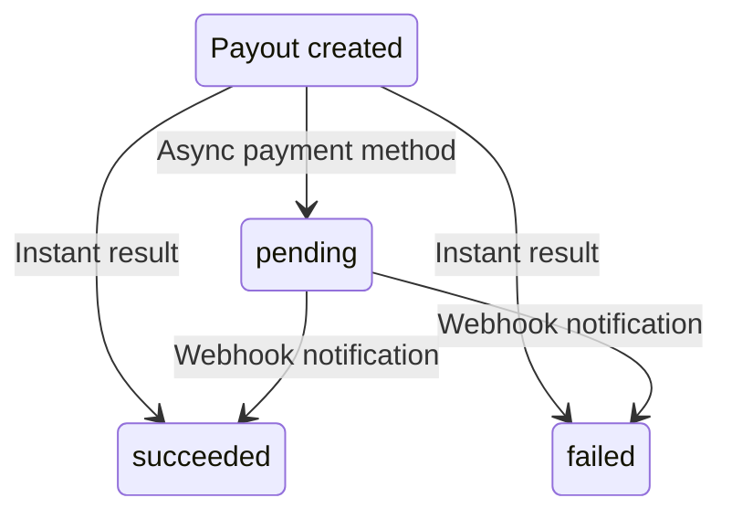

import { Callout } from 'fumadocs-ui/components/callout';

A payout transfers funds from your merchant account to a customer's payment method. It is the
reverse of a charge, instead of collecting money, you are sending it. Payouts are commonly
used in verticals like online gambling (paying out winnings), forex and trading platforms, and
gig economy marketplaces (paying drivers, freelancers, and so on).

## Creating a payout

Payouts are a backend-only flow. There is no customer-facing UI or SDK component, you start
them entirely via the API or the Pay.com dashboard.

To create a payout via the API, call `POST /v1/payouts` with a destination (a stored payment
method ID or raw payment details), amount, and currency. You can also start payouts from the
dashboard by navigating to a customer, clicking **Create payout**, entering the amount, and
confirming.

| Parameter | Required | Description |
|---|---|---|
| `destination` | Yes (or `destination_data`) | The ID of a stored payment method to send funds to. |
| `destination_data` | Yes (or `destination`) | Raw payment details for the payout destination (card, bank account, and so on). |
| `amount` | Yes | The amount to send in the smallest currency unit. |
| `currency` | Yes | The three-letter currency code (for example, `usd`, `eur`). |
| `customer_reference_id` | No | Your internal customer identifier. |
| `reference` | No | Your custom reference string for this payout. |
| `metadata` | No | Custom key-value pairs to attach to the payout. |

For step-by-step instructions, see the
[Create a payout](/docs/payments/server-to-server-guides/create-a-payout) guide.

## Payout statuses

Unlike charges, which resolve immediately, payouts may have an intermediate `pending` status
depending on the payment method and acquirer:

| Status | Meaning |
|---|---|
| `succeeded` | The payout was processed successfully. Funds are being sent to the customer. |
| `failed` | The payout was rejected. Funds were not sent. The `failure_code` and `failure_message` fields provide details. |
| `pending` | The payout has been submitted but the final result is not yet available. You will receive a webhook with the outcome. |

<Callout type="warn">
When using payment methods that return `pending` (such as ACH bank transfers), you **must**
register for webhooks to receive the final payout result. Do not treat `pending` as a success.
</Callout>

## Payment method compatibility

Not all payment methods support payouts. When a payment method is created or stored, the
`enabled_flows` field on the payment method object indicates whether it supports payouts (for
example, `["charges", "payouts"]`). Supported payout methods include cards, Apple Pay, Google
Pay, PayPal, Pix, and ACH bank transfers, among others. Availability depends on the payment
method type and the acquirer configuration. Check the `enabled_flows` field before attempting a
payout to confirm it is supported.

## Enabling payouts

Payouts need workspace-level enablement, which is configured by Pay.com during onboarding. This
is not a self-service feature, contact your account manager or solutions engineer to enable
payouts for your workspace. Once enabled, you can send payouts via the API or the dashboard
without further configuration.

## Key fields on the payout object

When you retrieve a payout via `GET /v1/payouts/{payout_id}`, the response includes these
important fields:

| Field | Description |
|---|---|
| `amount` | The payout amount in the smallest currency unit. |
| `payment_method` | The payment method funds were sent to. |
| `status` | The current payout status (`succeeded`, `failed`, or `pending`). |
| `failure_code` | A machine-readable code explaining the failure reason, if applicable. |
| `failure_message` | A human-readable description of the failure, if applicable. |

## Webhook events

Pay.com sends webhook events as a payout progresses through its lifecycle:

| Event | Trigger |
|---|---|
| `payout.succeeded` | The payout was completed successfully. |
| `payout.failed` | The payout failed. |
| `payout.pending` | The payout was submitted and is awaiting a final result. |

## Payouts vs. refunds

A **refund** returns funds from an existing charge back to the customer, it is always tied to
a charge and cannot exceed the original charge amount. A **payout** sends new funds from your
merchant account to a customer, it is an independent transaction with no inherent link to a
previous charge. Use refunds when reversing a payment; use payouts when distributing winnings,
commissions, or earnings.
