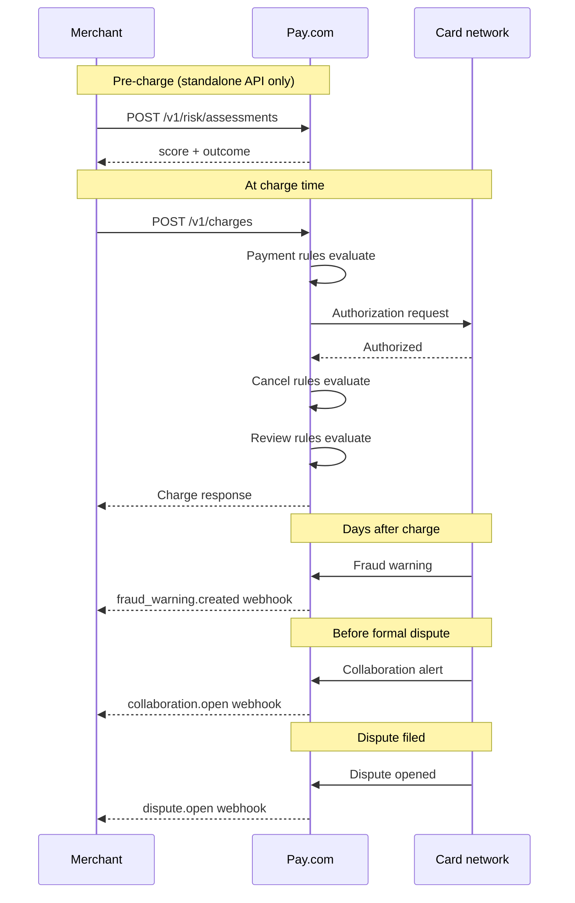
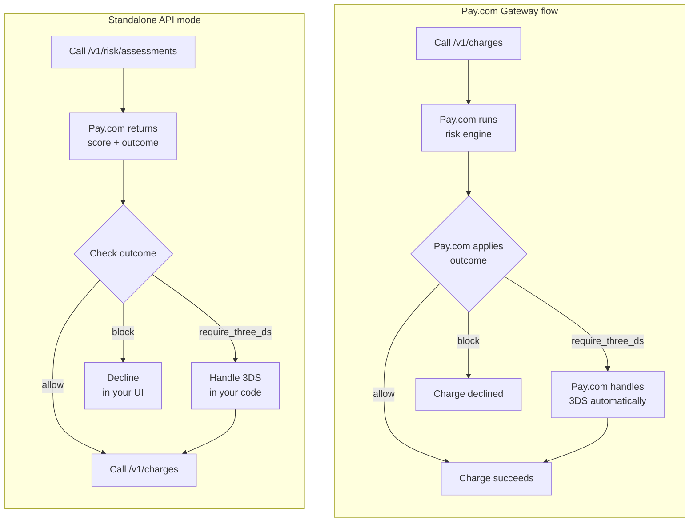

import { Callout } from 'fumadocs-ui/components/callout'

<Callout type="info">
  The risk tools available to you depend on the Pay.com services configured on your account. If a feature described in this section isn't accessible, contact Pay.com support.
</Callout>

Pay.com's risk tools work in layers. The earlier you catch a problem in the
transaction lifecycle, the lower the cost:

- A blocked charge costs nothing.
- A fraud warning you act on avoids a chargeback fee.
- A formal dispute you lose can affect your card network standing.

Each tool covers a different moment in that lifecycle, and they're designed to
work alongside each other.

## The layers of risk management

Risk management happens across four layers, from most proactive to most
reactive:

- **Prevention:** Score and gate transactions before or at charge time, using
  risk assessments and rules.
- **Detection:** Flag transactions for manual review after authorization,
  using review rules and the risk reviews API.
- **Early warning:** Act on fraud signals and pre-dispute alerts before a
  formal chargeback is filed, using fraud warnings and collaborations.
- **Formal resolution:** Manage the chargeback lifecycle when a dispute is
  filed.

Most integrations start with the prevention layer and add more layers as
their risk exposure grows.

## When each tool fires

Each tool applies at a specific point in the transaction lifecycle:

| Timing | Tool | What it does |
|---|---|---|
| Before the charge is created | [Risk assessments](/docs/risk-disputes-fraud/risk-assessments) | Calls the risk engine via the standalone API and returns an outcome you handle in your code. If you use Pay.com Gateway (Pay.com's payment processing service, which manages the full charge flow on your behalf), the risk engine runs automatically as part of each charge instead. |
| At charge time, before the card network | [Payment rules](/docs/risk-disputes-fraud/rules/payment-rules) | Blocks, authenticates, or exempts the charge automatically |
| At charge time, after authorization | [Cancel rules](/docs/risk-disputes-fraud/rules/cancel-rules) | Voids the authorization before settlement |
| After authorization | [Review rules](/docs/risk-disputes-fraud/rules/review-rules) | Flags the transaction or customer for manual review |
| After flagging | [Risk reviews](/docs/risk-disputes-fraud/risk-reviews) | You approve or decline the flagged item via the API |
| Days after the charge | [Fraud warnings](/docs/risk-disputes-fraud/fraud-warnings) | Card network reports the transaction as fraudulent |
| Before a formal dispute is filed | [Collaborations](/docs/risk-disputes-fraud/collaborations) | A pre-dispute alert arrives; you can refund to prevent a chargeback |
| Formal dispute filed | [Disputes](/docs/risk-disputes-fraud/disputes) | The full chargeback lifecycle begins |

## How tools connect to each other

Review rules and risk reviews work as a pair. A
[review rule](/docs/risk-disputes-fraud/rules/review-rules) defines the
conditions that flag a transaction after authorization. When a charge matches
the rule, Pay.com creates a risk review object automatically. You then inspect
and resolve that review using the
[Risk reviews API](/docs/risk-disputes-fraud/risk-reviews). Neither piece is
useful without the other: the rule creates the review, and the API lets you
act on it.

Rules and assessments are part of the same engine.
[Payment rules](/docs/risk-disputes-fraud/rules/payment-rules) run as part of
every risk assessment, whether you use the
[standalone API](/docs/risk-disputes-fraud/risk-assessments) or Pay.com Gateway
to process charges. The `outcome_source` field in `risk_assessment_details`
tells you which component produced the final decision:

- `"score"` means no rule matched and the score-to-threshold mapping produced
  the outcome.
- `"rule"` means a rule matched and produced the outcome. The `rule_id` field
  identifies which rule.

Fraud warnings and collaborations are different signals. Both arrive before a
formal chargeback, but they work differently:

- A **fraud warning** is a non-financial message from a card network reporting
  that a cardholder flagged a transaction as unauthorized. No funds move when
  you receive one. You can choose to refund proactively to prevent a
  chargeback.
- A **collaboration** is a pre-dispute alert from a card network or
  third-party service. It arrives when a cardholder challenges a transaction
  at a participating bank. You have a short window (typically 24 to 72 hours)
  to refund and close the case before it becomes a formal dispute.

## Where to start

The right entry point depends on what you're trying to solve:

- **Setting up fraud prevention for a new integration:** start with
  [payment rules](/docs/risk-disputes-fraud/rules/payment-rules). Rules are
  the most common first step for merchants who want automatic control over
  which charges proceed.
- **Need to score a card before creating a charge:** use the
  [risk assessment API](/docs/risk-disputes-fraud/risk-assessments) (requires
  Standalone Risk to be enabled). If you use Pay.com Gateway, the risk engine
  already runs automatically as part of each charge.
- **Already receiving chargebacks and want to act earlier:** start with
  [fraud warnings](/docs/risk-disputes-fraud/fraud-warnings) and
  [collaborations](/docs/risk-disputes-fraud/collaborations) to intercept
  disputes before they're formally filed.
