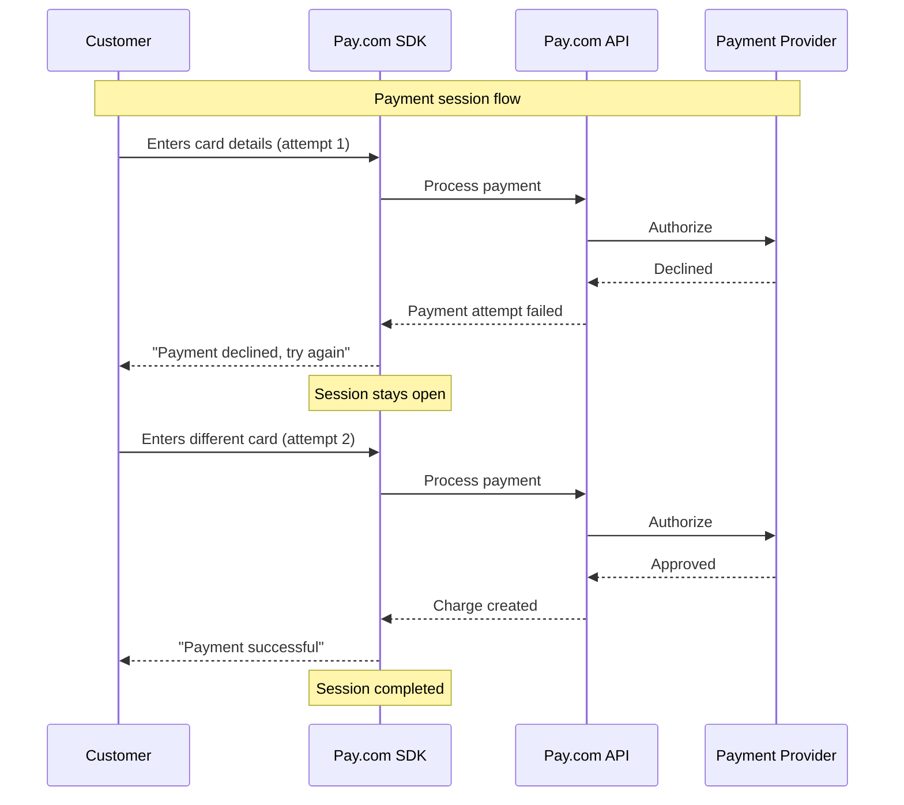
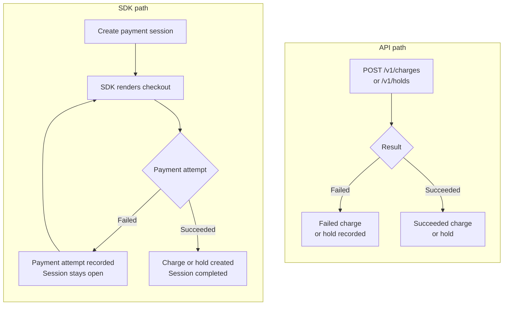

import { Callout } from 'fumadocs-ui/components/callout';

Pay.com draws a clear distinction between **sessions** (SDK-driven interactions) and
**transactions** (the underlying payment objects). Understanding this distinction is key to
working effectively with the platform, especially when reviewing activity in the dashboard or
processing webhooks.

## Sessions

A session represents a customer's checkout interaction managed by the Pay.com SDK. When you
embed the Pay.com SDK on your frontend, every customer interaction goes through a session.
There are two types:

| Session type | Purpose | Endpoint |
|---|---|---|
| **Payment session** | Collect a payment from the customer | `POST /v1/payment_sessions` |
| **Setup session** | Verify and save a payment method without charging | `POST /v1/setup_sessions` |

Your server creates a session via the API and receives a `client_secret`. You pass the
`client_secret` to the Pay.com SDK on your frontend, and the SDK renders the checkout UI,
handles payment method collection, manages 3D Secure challenges, and processes the payment. On
success, the session creates an underlying transaction — a charge or a hold.

A key feature of sessions is that they support **multiple payment attempts**. If a customer's
first attempt fails (wrong card, insufficient funds, and so on), the session stays `open` and
the customer can try again with a different payment method. Each failed attempt is recorded as
a payment attempt object, but no charge is created until a payment succeeds.

| Status | Meaning |
|---|---|
| `open` | The session is active. The customer can still attempt to pay. |
| `completed` | Payment succeeded. The session contains a reference to the created charge or hold. |
| `failed` | The session has expired or been abandoned without a successful payment. |

In this example, the dashboard would show one completed session with one failed payment attempt
and one successful charge.

For step-by-step instructions on creating a charge using the SDK, see the
[Create a charge with the SDK](/docs/payments/sdks/create-a-charge-with-sdk) guide.

## Transactions

Transactions are the actual payment objects that move money. They exist regardless of whether
you use the SDK or the API:

| Transaction type | What it represents | Created by |
|---|---|---|
| **Charge** | A payment that captures funds | SDK session (on success) or direct API call |
| **Hold** | An authorization that reserves funds | SDK session with `capture: false` or direct API call |
| **Refund** | A return of funds from a charge | API call or dashboard action |
| **Payout** | A transfer of funds to a customer | API call or dashboard action |

When you work directly with the Pay.com API (server-to-server), there are no sessions involved.
You create transactions directly via endpoints like `POST /v1/charges` or `POST /v1/holds`. In
this flow, both successful and failed transactions appear as charge or hold objects in your
activity log. There is no session wrapper and no payment attempt objects.

For step-by-step instructions on creating a charge via the API, see the
[Create a charge](/docs/payments/server-to-server-guides/create-a-charge) guide.

## Side-by-side comparison

The diagram and table below show how the two paths handle the same scenarios differently —
helping you choose the right approach for your integration.

| Aspect | SDK path (sessions) | API path (direct) |
|---|---|---|
| **Failed payments** | Recorded as payment attempts; no charge created | Recorded as failed charges or holds |
| **Multiple retries** | Handled automatically within the session | You manage retry logic yourself |
| **3D Secure** | Managed by the SDK automatically | You handle the authentication flow via linked auth sessions |
| **PCI requirements** | None, the SDK handles card collection | Required only if sending raw card details (PCI Level 1 / SAQ-D) |
| **Dashboard view** | Sessions tab + Transactions tab | Transactions tab only |
| **Customer experience** | Pay.com manages the UI, error handling, and retries | You build and control the entire experience |

## Dashboard activity

When you open the **Activity** tab in the Pay.com dashboard, you'll see two sub-tabs for
merchants using the SDK: **Sessions** (showing all payment sessions and setup sessions with
their statuses) and **Transactions** (showing all charges, holds, refunds, and payouts). For
API-only merchants, only the Transactions tab is visible since there are no sessions.

<Callout type="info">
A completed payment session always links to the underlying charge or hold it created. You can
navigate between them in the dashboard or retrieve the reference via the API.
</Callout>

## Combining SDK and API

You are not limited to one integration path. Many merchants use both, for example, the SDK for
the first payment to securely collect card details and create a stored payment method, then the
API with the stored token for subsequent or recurring payments.

Both paths share the same token vault, payment methods, and settlement accounts. A payment
method created through the SDK can be used in API calls and vice versa. For more on recurring
payment flows, see the
[Create recurring charges using sessions](/docs/payments/sdks/create-recurring-charges-using-sessions)
and [Create recurring charges](/docs/payments/server-to-server-guides/create-recurring-charges)
guides.
