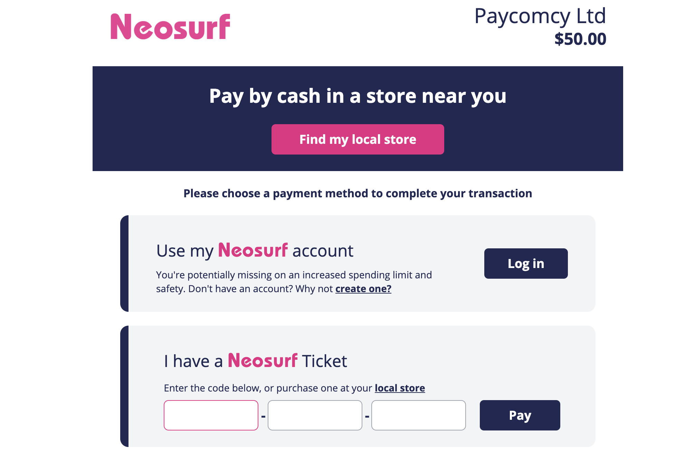

import { Callout } from 'fumadocs-ui/components/callout'
import { Tab, Tabs } from 'fumadocs-ui/components/tabs'
import { Step, Steps } from 'fumadocs-ui/components/steps'
import { ImageZoom } from 'fumadocs-ui/components/image-zoom'
import paymentMethodConfig from './payment-method-config.png'

Neosurf is a prepaid voucher and e-money wallet payment method that lets customers pay online without a credit card or bank account. Customers buy a Neosurf voucher at a retail outlet or online, then enter the 10-character PIN at checkout to pay instantly. It is widely used in France, Europe, Australia, and Canada, and is especially popular in online gaming, licensed gambling, crypto, and digital content verticals.

Enabling Neosurf opens your checkout to unbanked, underbanked, and privacy-conscious customers who prefer cash-backed payments and do not want to share card or banking information with merchants.

<Callout type="info">
Every Neosurf transaction is prepaid and guaranteed. There are no chargebacks.
</Callout>

## Payment method properties

| Property | Value |
|---|---|
| **Payment type** | Redirect (Neosurf-hosted payment page for PIN entry) |
| **Merchant countries** | Available globally, excluding [sanctioned countries](https://ofac.treasury.gov/sanctions-programs-and-country-information). Availability in some countries also depends on your license type. See [Licensing requirements](#licensing-requirements). |
| **Customer countries** | Andorra, Australia, Austria, Belgium, Canada, Croatia, Cyprus, Czech Republic, Denmark, Finland, France, Iceland, Ireland, Italy, Liechtenstein, Luxembourg, Malta, Mexico, Moldova, Netherlands, New Zealand, Poland, Portugal, Slovakia, Slovenia, Spain, Sweden, Switzerland, United Kingdom, United States |
| **Processing currencies** | AUD, BGN, BRL, CAD, CHF, CNY, CZK, DKK, EUR, GBP, HKD, HRK, HUF, IDR, ILS, INR, JPY, KRW, MXN, MYR, NOK, NZD, PHP, PLN, RON, RUB, SEK, SGD, THB, TRY, USD, XOF, ZAR |
| **Settlement currencies** | AUD, BGN, BRL, CAD, CHF, CNY, CZK, DKK, EUR, GBP, HKD, HRK, HUF, IDR, ILS, INR, JPY, KRW, MXN, MYR, NOK, NZD, PHP, PLN, RON, RUB, SEK, SGD, THB, TRY, USD, XOF, ZAR |
| **Transaction minimum** | 1 (smallest currency unit). The lowest available voucher denomination is €10. |
| **Transaction maximum** | 100,000,000 (smallest currency unit, e.g. $1,000,000). Single vouchers are capped at €150; higher amounts are supported via the [myNeosurf Account](https://www.neosurf.com/myneosurf-account/). |
| **Payment confirmation** | Immediate |
| **Settlement timing** | Monthly. Settlement reports are issued on the 1st of the following month; payouts are issued 30 days later (e.g. June 1st: Settlement Report for May; July 1st: Payout for May). |
| **Refunds** | Full and partially supported  |
| **Disputes** | Not supported |
| **Recurring payments** | Not supported |
| **Vaulting / saved credentials** | [[PLACEHOLDER, confirm with Pay.com]] |
| **3DS / SCA** | Not supported. No card is involved; the PIN is the authenticator |
| **Redirect required** | Yes. The customer is redirected to a Neosurf-hosted payment page for PIN entry |

## Customer payment flow

When a customer selects Neosurf at checkout, Pay.com creates a redirect URL
and sends the customer to a Neosurf-hosted page to complete payment. No card
or personal information is required.

<Steps>
<Step>
### Select Neosurf and proceed

The customer selects Neosurf on your checkout page and clicks **Pay**. Pay.com
generates a Neosurf redirect URL and sends the customer to the Neosurf-hosted
payment page.
</Step>

<Step>
### Choose a payment option on the Neosurf page

The Neosurf-hosted page presents the customer with two options:



- **Use my Neosurf account**: the customer clicks **Log in** to authenticate with their myNeosurf account and pay from their account balance. This option supports higher spending limits than a single voucher.
- **I have a Neosurf Ticket**: the customer enters their voucher PIN into the split code field (three segments) and clicks **Pay**.

The page also shows a **Find my local store** banner for customers who don't have a voucher yet and want to purchase one at a nearby retail outlet before completing the transaction.
</Step>

<Step>
### Neosurf verifies the payment

Neosurf checks the PIN and available balance. On success, it shows a
confirmation screen. On failure (invalid PIN, expired voucher, or insufficient
balance), it shows an error and the charge status moves to `failed`. No funds are captured.
</Step>

<Step>
### Return to your site

After the customer submits payment, Pay.com waits for Neosurf to confirm the
result. Once confirmed, the customer is redirected back to your site.
</Step>
</Steps>

<Callout type="warn">
If the customer closes the Neosurf-hosted page without completing payment, the charge remains in `pending` status until the session expires, at which point it moves to `failed` and a `charge.failed` webhook event is sent to your endpoint. Do not fulfill the order until you receive a `charge.succeeded` event.
</Callout>

## Before you begin

**Account prerequisites:**

- You must have an active Pay.com merchant account with Neosurf enabled. Contact your account manager to enable Neosurf for your account.
- You do not need a separate Neosurf merchant account. Pay.com manages the Neosurf integration on your behalf.

### Licensing requirements

As a regulated Electronic Money Institution (EMI), Pay.com requires merchants to hold local licenses in countries where this is a regulatory requirement. Licensing requirements vary by your license type:

| License | Countries requiring a local license |
|---|---|
| Anjouan | New Zealand, Canada (excluding Ontario) |
| Tobique | Australia, New Zealand, Canada (excluding Ontario) |
| Curacao | Australia, New Zealand, Canada (excluding Ontario) |
| Kahnawake | Australia, New Zealand, Canada (excluding Ontario) |
| MGA License / Isle of Man / Gibraltar | Various countries (confirm with your account manager) |

Local licenses are also required in Spain, Italy, Belgium, Netherlands, Ontario, Switzerland, USA, and Mexico regardless of gaming license type.

<Callout type="info">
Regulatory requirements are subject to change. Confirm your licensing status with your account manager before going live.
</Callout>

**Technical prerequisites:**

- No additional SDK or library is required beyond the standard Pay.com integration.
- The Neosurf payment page is served by Neosurf's servers. Ensure your Content Security Policy allows `*.neosurf.com` as a `frame-src` directive value.

## Configuration

Before you can accept Neosurf payments, the payment method must be enabled on your Pay.com account and made visible at checkout. The following sections walk you through enabling Neosurf from your Pay.com dashboard.

### Dashboard configuration

Neosurf is enabled on your account by your account manager and should already be visible in your dashboard. Follow the steps below to select or deselect Neosurf as an active payment method at checkout.

<Callout type="info">
If you cannot see Neosurf in your dashboard, contact your account manager to have it enabled on your account before continuing with the steps below.
</Callout>

<Steps>
<Step>
#### Open your account settings
Click your profile name in the top-right corner of your [Pay.com dashboard](https://dashboard.pay.com) and select **Settings**.
</Step>

<Step>
#### Navigate to payment methods configuration
In the settings menu, go to **Payment methods configuration**.
</Step>

<Step>
#### Open the default configuration
Select the **Default configuration** step. You will see all the payment methods currently configured on your account and visible to your customers at checkout.
</Step>

<Step>
#### Enter edit mode
Click the **Edit** button in the top-right corner of the page to modify the configuration.
</Step>

<Step>
#### Enable Neosurf at checkout
In the **Payment method types** section, click **Select payment methods**. Toggle Neosurf on to make it available at checkout, or toggle it off to hide it from your customers.
</Step>
</Steps>

<ImageZoom src={paymentMethodConfig} alt="Payment methods configuration in the Pay.com dashboard" />

### Session parameters

This section applies to the **SDK integration path only**. If you are using
the API path, skip to [Integration paths](#integration-paths), no payment
session is required.

For the SDK, create a payment session on your server before loading the SDK.
Include `"neosurf"` in the `payment_method_types` array to make it available
at checkout.

```json
{
  "amount": 5000,
  "currency": "eur",
  "payment_method_types": ["card", "neosurf"]
}
```

Pass the `client_secret` from the response to your front-end to initialize
the SDK. Pay.com renders the Neosurf option automatically once the session
is loaded.

## Integration paths

Pay.com supports two integration paths for Neosurf.

<Tabs items={['SDK', 'API']}>
<Tab value="SDK">

### Universal SDK

Neosurf renders automatically within the universal web checkout when it is enabled on your account. No additional code is required beyond the standard SDK initialization. See the [Get started with the Pay.com SDK](/docs/payments/sdks/integrate-the-pay-com-sdk) guide for setup instructions.

### Headless SDK

Use the Headless SDK when you want to control the user interface and trigger the Neosurf redirect programmatically.

Check whether Neosurf is available for the current session after initializing the checkout instance:

```javascript
const canMakePaymentsResult = await checkout.canMakePayments()
// Example result: { neosurf: true }

if (canMakePaymentsResult.neosurf) {
  // Show your Neosurf payment option
}
```

**Attach `handleNeosurf` to your Neosurf button's click handler to trigger the redirect:**

```javascript
async function handleNeosurf() {
  await checkout.headless('neosurf')
}
```

Pay.com opens the Neosurf-hosted payment page and handles the result. Once the customer returns, it fires `onSuccess` if the payment was completed or `onFailure` if the PIN was rejected, the voucher had insufficient balance, or the customer abandoned the payment page.

</Tab>
<Tab value="API">

Initiating a Neosurf payment via the API takes two steps: create the charge,
then create a linked authentication session to get the URL for the
Neosurf-hosted payment page.

**Step 1: Create the charge**

<Callout type="info">
Amounts are in the smallest currency unit. `5000` equals €50.00 EUR.
</Callout>

Send a [`POST /v1/charges`](/docs/api-reference/endpoints/charges/create-charge) request with `source_data.type` set to `"neosurf"`.
Neosurf availability varies by country, so `source_data.billing_details.address.country`
is required to route the transaction correctly.

<Tabs items={['Request', 'Response']}>
  <Tab value="Request">
```json
{
  "amount": 5000,
  "currency": "eur",
  "source_data": {
    "type": "neosurf",
    "billing_details": {
      "address": {
        "country": "FR"
      }
    }
  },
  "customer_reference_id": "cust-001",
  "description": "Order #12345",
  "reference": "order-12345"
}
```
  </Tab>
  <Tab value="Response">
```json
{
  "id": "chrg_702172227948251136",
  "resource": "charge",
  "amount": 5000,
  "amount_human_readable": "50.00",
  "currency": "eur",
  "status": "requires_authentication",
  "payment_method_details": {
    "third_party_tokens": [],
    "type": "neosurf"
  },
  "failure_code": null,
  "failure_message": null,
  "customer_reference_id": "cust-001",
  "description": "Order #12345",
  "reference": "order-12345",
  "created": "2026-04-22T15:01:45.383Z",
  "test_mode": true
}
```
  </Tab>
</Tabs>

The charge is created with `status: "requires_authentication"`. Use the
returned charge `id` in the next step.

**Step 2: Create a linked authentication session**

Send a [`POST /v1/sessions/authentication/linked`](/docs/api-reference/endpoints/authenticationsessions/create-linked-authentication-session) request with the charge ID,
`confirm: true`, and the `return_url` the customer is redirected to after
completing payment.

<Tabs items={['Request', 'Response']}>
  <Tab value="Request">
```json
{
  "resource": "chrg_702172227948251136",
  "confirm": true,
  "return_url": "https://your-site.com/payment/complete"
}
```
  </Tab>
  <Tab value="Response">
```json
{
  "id": "sca_702172392511768576",
  "resource": "authentication_session",
  "amount": 5000,
  "currency": "eur",
  "status": "open",
  "return_url": "https://your-site.com/payment/complete",
  "url": "https://alternatives.dev.pay.com/authenticate?client_secret=...",
  "created": "2026-04-22T15:02:24.115Z",
  "test_mode": true
}
```
  </Tab>
</Tabs>

Redirect the customer to the `url` in the response. Once the customer
completes PIN entry, Neosurf posts the result back to Pay.com, which updates
the charge status and sends a webhook event to your endpoint.

</Tab>
</Tabs>

## Testing

Test your Neosurf integration using your [Pay.com test API key](/docs/api-reference/get-started/authentication). The base URL and endpoints are the same as production, only the API key determines whether a transaction is a test. No real funds are moved.

<Callout type="info">
Pay.com provides the test PINs you need to simulate each scenario below.
Contact your Pay.com account manager if you haven't received them.
</Callout>

### Test scenarios

| Scenario | Test action | Expected result |
|---|---|---|
| Successful payment | Enter a valid test PIN with sufficient balance | Charge `status: "succeeded"`. `charge.succeeded` webhook fires. SDK `onSuccess` callback fires. |
| Insufficient balance | Enter a test PIN whose balance is lower than the charge amount | Charge `status: "failed"` and `charge.failed` webhook fires. SDK `onFailure` callback fires. |
| Invalid PIN | Enter an incorrect or malformed PIN | Charge `status: "failed"` and `charge.failed` webhook fires. SDK `onFailure` callback fires. |
| Expired voucher | Enter a test PIN for an expired voucher | Charge `status: "failed"` and `charge.failed` webhook fires. SDK `onFailure` callback fires. |

## Handling payment events

Subscribe to the following webhook events to track Neosurf charge outcomes.

| Webhook event | Trigger condition | Recommended action |
|---|---|---|
| `charge.succeeded` | The PIN was accepted and the charge captured successfully | Fulfill the order and send a confirmation to the customer |
| `charge.failed` | The PIN was rejected, the voucher had insufficient balance, or the voucher was expired | Notify the customer and prompt them to use a different voucher or payment method |
| `charge.pending` | The charge has been initiated but the customer has not yet completed PIN entry | Wait for `charge.succeeded` or `charge.failed` before fulfilling the order |

<Callout type="warn">
Always verify webhook signatures using the `Pay-Signature` header and your endpoint's secret key (HMAC SHA-256) before acting on any event. See the [Webhooks overview](/payments/webhooks) for verification instructions.
</Callout>

Because Neosurf confirmation is immediate once the PIN is accepted, `charge.pending` is a transitional state only. A `charge.succeeded` event is the only event you need to fulfill an order.

## Next steps

- [Webhooks overview](/docs/payments/webhooks): verify webhook signatures and handle delivery retries
- [Create a charge](/docs/api-reference/endpoints/charges/create-charge): full API reference for `POST /v1/charges`
- [Create a linked authentication session](/docs/api-reference/endpoints/authenticationsessions/create-linked-authentication-session): full API reference for `POST /v1/sessions/authentication/linked`
