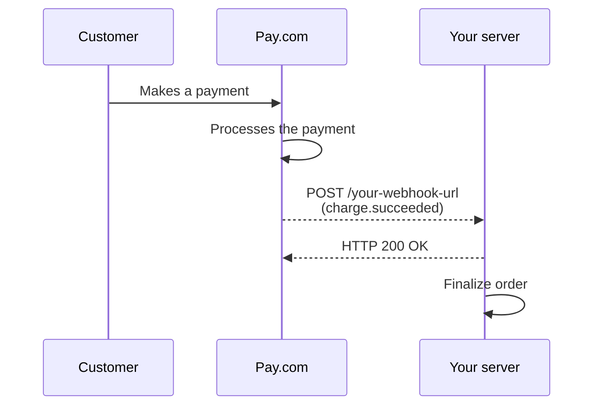
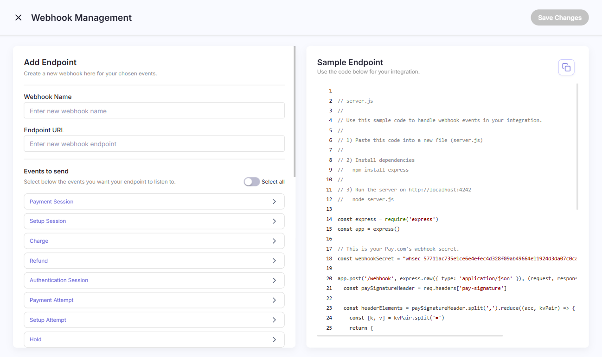

import { Step, Steps } from 'fumadocs-ui/components/steps'
import { Callout } from 'fumadocs-ui/components/callout'

Webhooks let Pay.com notify your backend systems about events as they happen,
without your server having to poll the API. When something changes in your
account (a charge succeeds, a refund is processed, a payout completes), Pay.com
sends an HTTP `POST` request with a JSON payload to a URL you configure.



## When webhooks are required

Webhooks are useful for logging all activity, but they are required for
certain asynchronous payment flows:

- **3D Secure with `confirm: true`:** When you configure a server-to-server
  3DS flow with automatic authorization, the charge is authorized before the
  customer is redirected back to your site. A dropped network connection can
  prevent the redirect from completing, so you must listen for the
  `charge.succeeded` webhook to finalize the order.
- **ACH and SEPA direct debits:** These payment methods don't clear
  immediately. The API creates a charge with `pending` status, and the final
  outcome is delivered only via webhook once the banking network updates
  Pay.com.
- **Bank transfer payouts:** Payouts start as `pending` and the final
  `payout.succeeded` or `payout.failed` event arrives asynchronously.

<Callout type="warn">
Always verify the signature of every webhook event before processing it.
This confirms the event genuinely came from Pay.com and not a third party.
</Callout>

## Set up a webhook endpoint

<Steps>
<Step>
### Access the dashboard

Log in to your Pay.com dashboard. In the left sidebar, click **Developers**,
then select **Webhooks**. This page lists all existing webhook endpoints
configured for your account.
</Step>
<Step>
### Create a new webhook

Click **+ Add Webhook**. You are redirected to the **Webhook Management**
page.



Fill in the following fields:

- **Webhook Name**: a label to identify this endpoint in the dashboard.
- **Endpoint URL**: the public URL on your server that will receive the
  `POST` requests.
- **Events to send**: choose **All events** to receive every notification,
  or select individual event types to limit the webhook to a specific use
  case.

The dashboard also provides a ready-to-use code sample you can paste into
a new file to get a working endpoint running locally:

```js
// server.js
// 1) Install dependencies: npm install express
// 2) Run: node server.js

const express = require('express')
const crypto = require('crypto')
const app = express()

// Your Pay.com webhook secret (revealed after creating the endpoint).
const webhookSecret = 'YOUR_WEBHOOK_SECRET'

app.post('/webhook', express.raw({ type: 'application/json' }), (req, res) => {
  const paySignatureHeader = req.headers['pay-signature']

  const headerElements = paySignatureHeader.split(',').reduce((acc, kvPair) => {
    const [k, v] = kvPair.split('=')
    return { ...acc, [k]: v }
  }, {})

  const { t: timestamp, v1: signatureToCompare } = headerElements

  const bodyJson = JSON.stringify(req.body)
  const signedPayload = [timestamp, bodyJson].join('.')

  const computedSignature = crypto
    .createHmac('sha256', webhookSecret)
    .update(signedPayload, 'utf8')
    .digest('hex')

  const isWebhookValid = computedSignature === signatureToCompare

  if (!isWebhookValid) return res.status(400).send('Invalid webhook signature')

  // Return a 200 response to acknowledge receipt of the event.
  res.status(200).send()
})

app.listen(4242, () => console.log('Running on port 4242'))
```

When you're done, click **Save changes** to create the webhook.
</Step>
<Step>
### Copy your signing secret

After saving, you are redirected back to the **Webhooks** list. Click the
webhook you just created to open its detail page.

Here you can reveal and copy the **signing secret** for this endpoint. You
will use this secret to verify the signature of every incoming event. You
can also edit, disable, or delete the webhook from this page.

Store the signing secret securely and never expose it in client-side code
or public repositories.
</Step>
</Steps>

## Monitor webhook deliveries

Select any webhook from the **Developers > Webhooks** page to view its
delivery log. For each event you can inspect:

- The event status and HTTP status code.
- The event ID and when it was created.
- The full request payload Pay.com sent.
- The response your server returned.
- Details about the next retry attempt if the previous delivery failed.

If your server misses an event, you can manually resend it from this view.

Pay.com retries failed deliveries every 15 minutes for up to 24 hours. Retries
stop as soon as your server returns a `2xx` response.

## Verify webhook signatures

Pay.com signs every webhook event with an HMAC-SHA256 signature and includes
it in the `Pay-Signature` HTTP header. Verifying this signature confirms that
the event came from Pay.com and has not been tampered with.

The `Pay-Signature` header contains a timestamp (prefixed by `t=`) and a
signature (prefixed by `v1=`). For example:

```
Pay-Signature: t=1694123456,v1=abc123def456...
```

<Steps>
<Step>
### Extract the timestamp and signature

Split the `Pay-Signature` header value on the `,` character to get a list of
elements. Then split each element on `=` to separate the prefix from the value.

- The value for prefix `t` is the timestamp.
- The value for prefix `v1` is the signature.

Ignore any other prefixes to prevent downgrade attacks.

```python
header = request.headers.get("Pay-Signature")
elements = header.split(",")
parts = {}
for element in elements:
    prefix, value = element.split("=", 1)
    parts[prefix] = value

timestamp = parts["t"]
received_signature = parts["v1"]
```
</Step>
<Step>
### Build the signed payload string

Construct the string that Pay.com used to compute the signature by
concatenating:

1. The timestamp (as a string).
2. A literal `.` character.
3. The raw JSON request body, exactly as received and before any parsing.

```python
signed_payload = f"{timestamp}.{request.body}"
```

<Callout type="warn">
Use the raw request body, not a re-serialized version. Parsing and
re-serializing JSON can change whitespace or key ordering, which causes
signature verification to fail.
</Callout>
</Step>
<Step>
### Compute the expected signature

Using your endpoint's signing secret as the key, compute an HMAC with the
SHA-256 hash function over the `signed_payload` string.

```python
import hmac
import hashlib

expected_signature = hmac.new(
    key=YOUR_SIGNING_SECRET.encode("utf-8"),
    msg=signed_payload.encode("utf-8"),
    digestmod=hashlib.sha256
).hexdigest()
```
</Step>
<Step>
### Compare the signatures and validate the timestamp

Use a constant-time comparison to compare the expected signature to the
received `v1` signature. This protects against timing attacks.

After confirming the signatures match, check that the difference between the
current time and the received timestamp is within your acceptable tolerance
(typically 300 seconds). Reject events outside this window to protect against
replay attacks.

```python
import hmac
import time

if not hmac.compare_digest(expected_signature, received_signature):
    raise ValueError("Invalid signature")

if abs(time.time() - int(timestamp)) > 300:
    raise ValueError("Timestamp outside tolerance")

# Signature is valid — safe to process the event.
```
</Step>
</Steps>

## Next steps

- [Webhook events](/documentation/payments/webhooks/webhook-events) —
  a complete list of all event types Pay.com can send, organized by resource.
