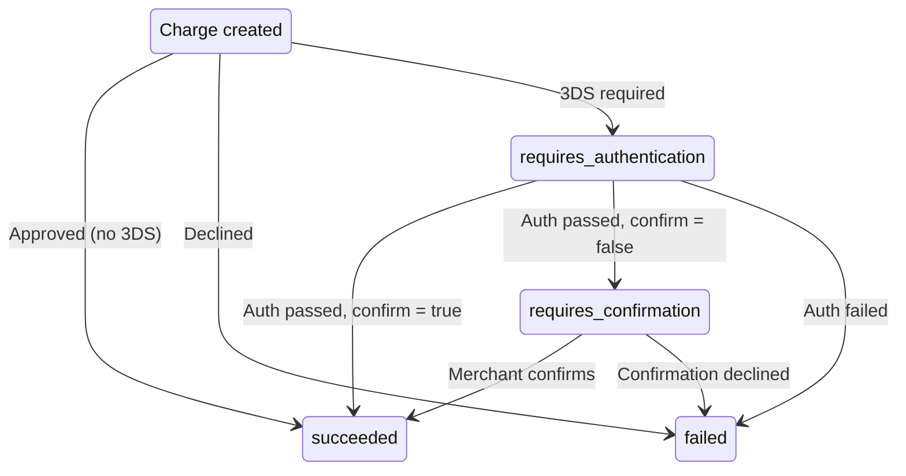

import { Callout } from 'fumadocs-ui/components/callout';

A charge is the core transaction type in Pay.com for capturing a payment. When a charge
succeeds, funds are moved from the customer's payment method to your account.

## Creating a charge

There are two ways to create a charge, depending on your integration path.

With the **SDK**, you create a payment session with `capture: true` (the default) via
`POST /v1/payment_sessions`. The SDK handles payment method collection, 3D Secure, and
processing. On success, a charge is created automatically. See the
[Create a charge with the SDK](/docs/payments/sdks/create-a-charge-with-sdk) guide for
step-by-step instructions.

With the **API**, you create a charge directly by calling `POST /v1/charges`. You can provide
a stored payment method, a token, or raw card details (PCI Level 1 required for raw card data).
See the [Create a charge](/docs/payments/server-to-server-guides/create-a-charge) guide for
the server-to-server flow, or
[Create a charge with 3DS](/docs/payments/server-to-server-guides/create-a-charge-with-3ds)
if your integration requires 3D Secure authentication.

For wallet payments, see
[Create a charge with a wallet (SDK)](/docs/payments/sdks/create-a-wallet-charge) or
[Create a charge with a wallet (API)](/docs/payments/server-to-server-guides/create-a-charge-with-a-wallet).

## Charge statuses

A charge can resolve immediately or pass through authentication and confirmation steps depending
on your 3D Secure configuration:

| Status | Meaning |
|---|---|
| `succeeded` | The charge was approved and funds have been captured. |
| `failed` | The charge was declined by the issuer or blocked by a payment rule. |
| `requires_authentication` | The charge needs 3D Secure authentication before it can be completed. |
| `requires_confirmation` | Authentication is complete, but the merchant must explicitly confirm the charge (when using `confirm: false`). |

When the API returns `requires_authentication`, you need to create a linked authentication
session to complete the 3D Secure challenge. See the
[Create a linked authentication session](/docs/api-reference/authenticationsessions/create-linked)
endpoint for details.

<Callout type="info">
When using the SDK, 3D Secure is handled automatically. The SDK manages the challenge UI and
redirections, so no additional code is needed.
</Callout>

## Key fields on the charge object

When you retrieve a charge via `GET /v1/charges/{charge_id}`, the response includes these
important fields:

| Field | Description |
|---|---|
| `amount` | The charge amount in the smallest currency unit (for example, cents). |
| `amount_refunded` | The total amount that has been refunded from this charge. |
| `status` | The current status of the charge. |
| `payment_method` | The ID of the payment method used. |
| `hold` | If this charge was created by capturing a hold, the hold ID. |
| `payment_session` | If this charge was created from a payment session, the session ID. |
| `refunds` | A list of refund objects linked to this charge. |
| `metadata` | Custom key-value pairs attached to the charge. |

A charge can also be created by capturing a hold. When you capture a hold (fully or partially),
a charge object is created and linked to the original hold via the `hold` field. See
[Holds and captures](/docs/payments/payment-concepts/holds-and-captures) for details.

## Webhook events

Pay.com sends webhook events as a charge progresses through its lifecycle:

| Event | Trigger |
|---|---|
| `charge.succeeded` | The charge was approved. |
| `charge.failed` | The charge was declined or blocked. |
| `charge.requires_authentication` | 3D Secure is required. |
| `charge.requires_confirmation` | Authentication succeeded; awaiting merchant confirmation. |
| `charge.refunded` | A refund was processed against this charge. |
