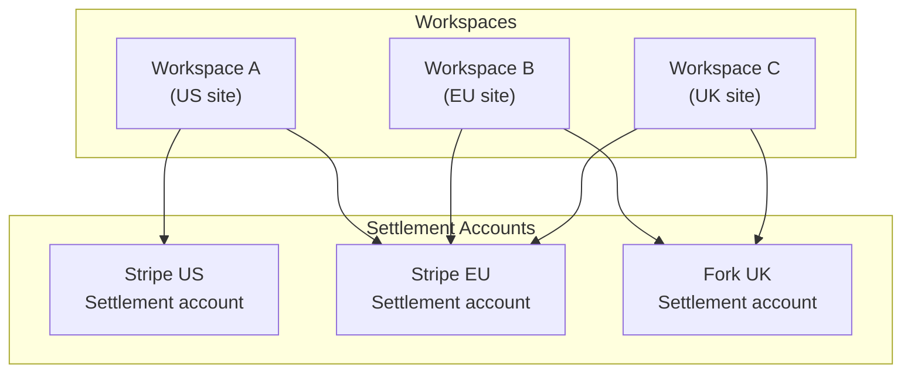

import { Callout } from 'fumadocs-ui/components/callout';

Pay.com uses two core organizational concepts that give you full flexibility over how you manage
your payment operations: **workspaces** and **settlement accounts**. Together, they form the
foundation of Pay.com's orchestration layer.

## Workspaces

A workspace is your operational environment within Pay.com. It is where you manage
transactions, configure routing logic, set up payment rules, and view your payment data through
the dashboard.

Every Pay.com merchant has at least one workspace, but you can create as many as you need.
There is no additional cost for using multiple workspaces.

A workspace doesn't have a fixed meaning, you decide what it represents based on your business
needs. Common strategies include:

- **Single workspace:** All payments across all brands, regions, and providers in one place.
  Best for merchants who want a unified view of their entire operation.
- **Per country or region:** A workspace for US customers, another for UK, another for Europe.
  Useful when you need to separate data and permissions by geography.
- **Per brand or website:** A workspace for each brand you operate. Helpful when different
  teams manage different products or storefronts.
- **Any combination:** You can mix strategies however it makes sense for your business.

Each workspace gives you access to a dashboard with payment analytics and transaction activity,
payment rules and routing configuration, activity logs showing sessions and transactions, and
filtering and reporting by date range, customer country, currency, provider, payment method,
card brand, and other dimensions.

<Callout type="info">
Workspaces are currently configured together with Pay.com during your onboarding process.
Self-service workspace creation is on our roadmap.
</Callout>

## Settlement accounts

A settlement account represents a configured connection to a payment provider or acquirer. When
you set up a provider, such as Stripe, Adyen, or any other acquirer, a settlement account is
created for that connection.

If you work with multiple acquirers or have multiple accounts with the same acquirer, you will
have a settlement account for each one. For example, a merchant might have four Stripe
settlement accounts (each configured for different regions or currencies), one Fork account,
and one Pay.com account, all managed from a single workspace.

## How they connect

Workspaces and settlement accounts have a **many-to-many relationship**. A single settlement
account can be shared across multiple workspaces, and a single workspace can route transactions
to multiple settlement accounts. This flexibility is at the heart of Pay.com's orchestration
model. You connect once to each provider, and then you decide how to route transactions across
your workspaces without needing to reconfigure provider connections for each one.

In this example, the Stripe EU settlement account is shared across all three workspaces, while
Stripe US is only used by Workspace A and Fork UK is shared between Workspaces B and C. This
is the kind of flexible routing that Pay.com's orchestration enables.

## Key takeaways

The table below summarizes the role of each concept and who controls it:

| Concept | What it is | Who controls it |
|---|---|---|
| **Workspace** | An orchestration environment for managing transactions, routing, and analytics | You decide the structure |
| **Settlement account** | A configured connection to a payment provider or acquirer | Created when you add a provider |

## Next steps

Now that you understand how workspaces and settlement accounts work together, explore how
payments flow through them:

- [Payment lifecycle overview](/docs/payments/payment-concepts/payment-lifecycle-overview): see how transactions flow through your workspaces and settlement accounts.
- [Sessions vs. transactions](/docs/payments/payment-concepts/sessions-vs-transactions): understand the difference between SDK sessions and API transactions.
- [Charges](/docs/payments/payment-concepts/charges): learn how to create and manage charges.
